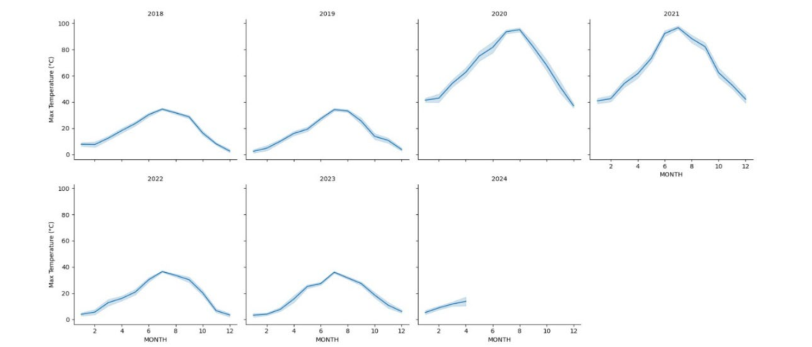
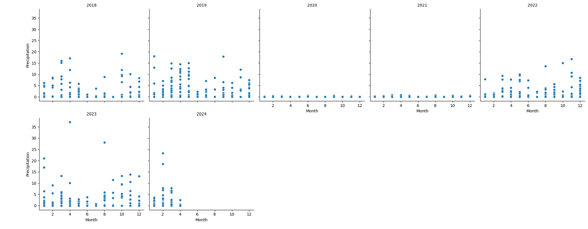

# Environmental Sensor Data Analysis

## Description of the Project

### Introduction
In an era where environmental changes are increasingly unpredictable, this project aims to construct a data pipeline to process environmental sensor data, enabling advanced analytics and predictive modeling. By analyzing this data, we can identify trends and patterns that contribute to more informed decision-making in environmental policy and management.

### Problem Statement
The project addresses the need to analyze environmental data and predict weather conditions using machine learning models. By leveraging historical and real-time data, the pipeline forecasts future weather trends and identifies patterns in environmental changes.

### Motivation
With unpredictable environmental changes, the project focuses on harnessing advancements in cloud computing and machine learning to analyze environmental data and provide proactive insights.

### Objectives
The primary goal is to demonstrate a robust data handling and analysis framework capable of:
- Efficiently extract, transform, and store sensor data for analysis.
- Build a scalable pipeline for data processing and ML deployment.
- Generate visualizations and predictive insights to analyze environmental patterns.

### Data Engineering Goals
- **Efficient Data Ingestion and Storage**: Extract data from sources like GitHub and APIs, storing it in Azure Data Lake.
- **Automated Data Workflow Management**: Utilize Apache Airflow to orchestrate data processing, ensuring data integrity and timeliness.
- **Robust Data Processing and Transformation**: Clean, normalize, and engineer features for analysis.
- **Scalable Data Analytics and Machine Learning Deployment**: Analyze processed data for insights and predict future trends using machine learning models.

## Technologies and Methodology
- **Google Colab**: Used for data ingestion, transformation, and ETL processes.
- **Apache Airflow**: Manages workflow, specifically for triggering API calls for weather forecasting.
- **Azure Data Lake**: Storage of transformed data, with tools like Azure Synapse Analytics and Databricks for machine learning models.
- **Databricks**: Analyzes datasets and develops machine learning models.
- **Visual Crossing Weather API**: Tests the machine learning model and predicts future weather.

## Data Source
- **Primary Data Source**: Visual Crossing Weather API and GitHub [DATA](https://github.com/gnair60/EnviroDataPipeline-AzureAirflow/blob/main/Data.zip)(historical weather data from 2018 to 2024).
- **GitHub Data Link**: [Sensor Data](https://github.com/gnair60/EnviroDataPipeline-AzureAirflow/blob/main/Sensor_Data.zip)

## Workflow and Architecture
The workflow consists of four main stages:
1. **Extract**: Fetch data from Visual Crossing Weather API and GitHub.
2. **Load**: Ingest data into Google Colab, transform it, and load it into Azure Data Lake.
3. **Transform**: Apply data cleaning, feature engineering, and normalization processes.
4. **Serve**: Utilize processed data to generate analytics and drive machine learning models.

## Project Visualization
Graphs and visualizations were created to illustrate each component of the lifecycle and to demonstrate how data pipelines were organized from source systems to destination systems.
The project generated visualizations to illustrate trends:

- Line Charts: Yearly temperature and precipitation trends (2018–2024).

- Scatter Plots: Precipitation patterns across months and years.
  
- Histograms and Pie Charts: Distribution of weather types.
  

## Project Retrospective Part I
### Key Insights
- Intended pipeline vs. actual implementation differed slightly in technology choices and data handling processes.
- Knowledge of Azure cloud services like Synapse Analytics and Databricks would have improved project planning and execution.
- Significant hurdles included handling datasets with many null values and managing API limitations.

## Machine Learning Models
### Three machine learning algorithms were implemented and tested in Databricks:
- K-Nearest Neighbors (KNN): Accuracy – 84%
- Naive Bayes: Accuracy – 84%
- Decision Tree: Accuracy – 100% (noted to be overfitting with limited data)

## Lessons Learned
- Prior knowledge of Azure services would have streamlined the project.
- A streaming solution might have been more effective for real-time data analysis.

## Project Retrospective Part II
### Future Improvements
- Gaining hands-on experience with cloud platforms and advanced machine learning algorithms would be beneficial.
- Key takeaways included understanding the importance of cloud platforms and ETL tools in managing data efficiently.

## Conclusion
The project demonstrated that our machine learning model’s weather predictions align with predictions from reliable weather forecasting platforms, showcasing the potential of our data analysis and machine learning approach.
